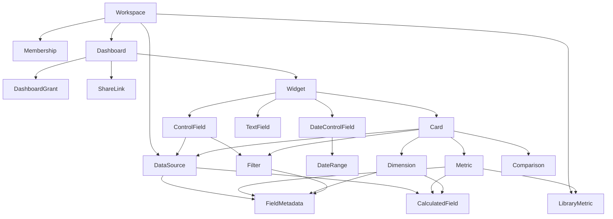

# Rundown data model

This folder defines the stored documents behind dashboards, datasources, and sharing. It reflects the decisions in [../plan.md](../plan.md). Query definitions (metrics, dimensions, filters) are separated from the widgets that render them.

Names use `camelCase`. Fields whose behavior is still undecided are marked optional and listed in [Open questions](./open-questions.md).

## Documents

- [Workspace and sharing](./workspace-and-sharing.md) defines workspaces, memberships, dashboard grants, and share links.
- [Datasource](./datasource.md) defines datasources, the field lookup table, calculated fields, and the workspace metric library.
- [Shared types](./shared-types.md) defines metrics, dimensions, date ranges, comparisons, sort, and styling.
- [Filters and controls](./filters-and-controls.md) defines filters, controls, control state, date controls, and rich text.
- [Cards](./cards.md) defines scorecards, gauges, charts, and tables.
- [Dashboard layout](./dashboard-layout.md) defines the dashboard document and grid placement.
- [Open questions](./open-questions.md) keeps the remaining unresolved items visible.

## Relationship map

## Conventions

- IDs are opaque strings. Every top-level document carries a `workspaceId`.
- A `fieldId` refers to either a column in the datasource's lookup table or a calculated field of the same datasource. Both share one namespace per datasource.
- A `canonicalName` is a stable, workspace-wide name for a field. Library metrics and cross-datasource controls match on it.
- Expressions are DuckDB SQL expressions, stored verbatim. Row-level expressions live on calculated fields. Aggregate expressions live on metrics and library metrics. The server compiles and validates them; clients never send SQL.
- `styling` is an open object. Each renderer owns its supported keys.
- Dates use ISO 8601 when fixed. Relative dates use a structured expression and resolve in the dashboard's timezone.
- Dashboards store a `schemaVersion` so stored JSON can be migrated.
